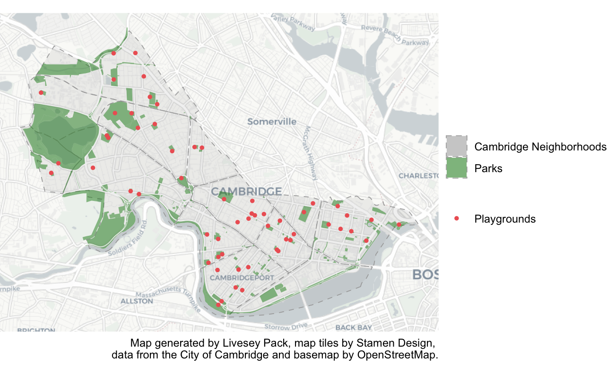
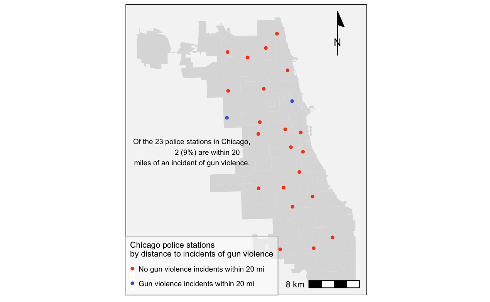
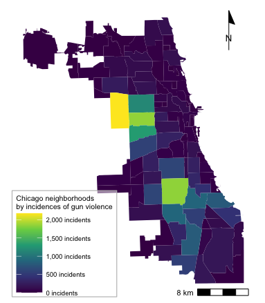
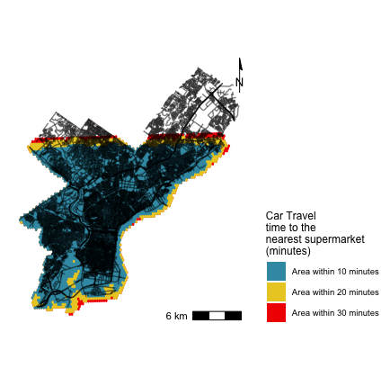
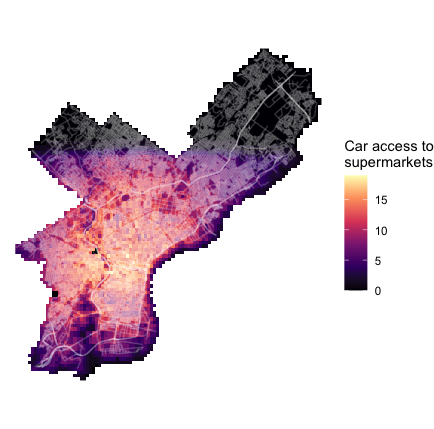
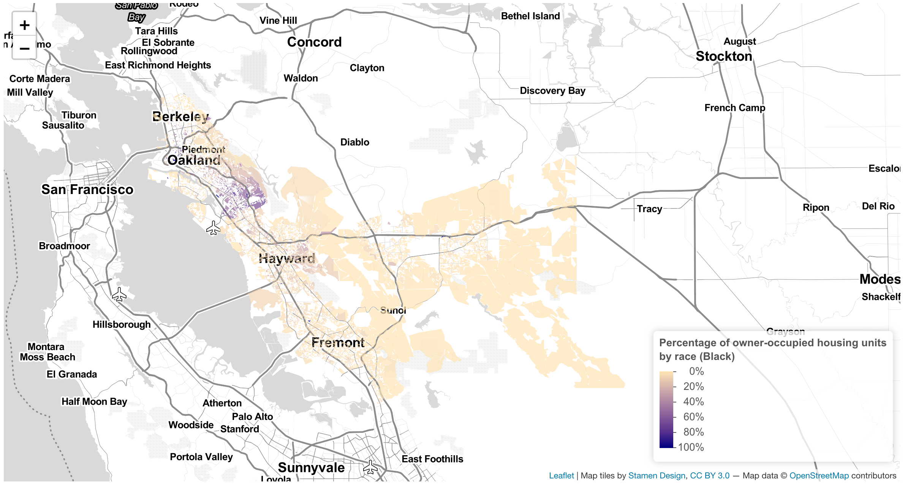

```{r setup, include=FALSE}
knitr::opts_chunk$set(echo = TRUE)
```

# Introduction
This portfolio comprises a sampling of maps created during a six-week module, "Spatial Analysis," at the Harvard Graduate School of Design in the fall of 2021. Each map highlights a skill, or skills, that demonstrate proficiency in analyzing and mapping geospatial data in R. 

# Displaying Multiple Vector Layers 

This map demonstrates the following skills: 

* Displaying multiple vector layers on the same map
* Load spatial datasets from a file
* Load a basemap image from the rosm package, using the ggspatial package

## Cambridge
[](https://lipack.github.io/Spatial-Analysis-Portfolio-/fullsize/Cambridge Map.pdf){target="_blank"}

The map includes base map of Cambridge, Massachusetts with two polygon layers (Cambridge neighborhoods and Cambridge recreation spaces) and one point layer (Cambridge playgrounds). The map displays the distribution of recreation spaces throughout Cambridge as well as the city’s playgrounds’ proximity to recreation spaces, or parks.

# Georeferencing

This georeferenced map demonstrates the following skills: 

* Georeferencing a raster image

## San Francisco
[](https://lipack.github.io/Spatial-Analysis-Portfolio-/fullsize/GeoRef.pdf){target="_blank}

The above map displays a georeferenced historic map of San Francisco. This map provides the basis for analysis of contemporary data sets, courtesy of San Francisco's open data portal. Specifically, this map looks at the overlay of the city's seismic hazard zones with respect to the development sites of the now-defunct San Francisco Redevelopment Authority.  

# Analyzing Relationships between Point and Polygon Layers

## Chicago 

The following two maps explore the spatial relationships between four sets of data, two point layers and two polygon layers, from the City of Chicago’s open data portal.These maps were pulled from an assignment investigating spatial patterns and relationships related to crime and community investment throughout Chicago. 

This map demonstrates the following skill: 

* Calculating and displaying relationships among point and polygon layers based on distance

[](https://lipack.github.io/Spatial-Analysis-Portfolio-/fullsize/chicago_map1.pdf){target="_blank"}

The above map examines the number of incidents of gun violence within an approximately 20-mile radius of Chicago's police stations. As the map highlights, only two of Chicago's twenty-three police stations met this criteria at the time this data was available.   

This map demonstrates the following skill: 

* Aggregating point data to a layer of polygons

[](https://lipack.github.io/Spatial-Analysis-Portfolio-/fullsize/Chicago_FINAL.pdf){target="_blank"}

The above map explores the frequency of incidents of gun violence within each Chicago neighborhood. 

# Calculating Accessibility 

The following two maps portray the accessibility of grocery stores by car in Philadelphia. Data was pulled from Philadelphia's open data portal (https://www.opendataphilly.org) as well as Open Street Maps. These maps were pulled from an assignment investigating the accessibility of Philadelphia's foodscape from the lens of transportation.  

## Isochrone Map

This map demonstrates the following skill:

* Calculating and displaying accessibility, based on travel time

[](https://lipack.github.io/Spatial-Analysis-Portfolio-/fullsize/accessibility_PHL_map.pdf){target="_blank"}

The above map shows a series of isochrones for car travel to the nearest supermarket, in increasing intervals of ten minutes. As the map demonstrates, the majority of supermarkets fall within the 10-minute isochrone, meaning most supermarkets are within a 10-minute car ride from any point on the grid. The map also shows the limitations of the supermarket location data from Open Street Maps, which does not feature any supermarkets in the northern part of the city (even though they exist). 

## Accessibility Matrix 

This map demonstrates the following skills:

* Converting between raster layers and vector layers
* Displaying raster data on a map

[](https://lipack.github.io/Spatial-Analysis-Portfolio-/fullsize/raster_PHL_map.pdf){target="_blank"}

The above map demonstrates the accessibility of grocery stores within a ten-minute car ride. As the map shows, it is possible to reach several different grocery stores within a ten-minute drive throughout the majority of the city.

# Interactive Mapping

This map demonstrates the following skills:

* Accessing and analyzing census data 
* Displaying data on an interactive map

## Alameda County

[](https://c-voulgaris.github.io/portfolio_examples/fullsize/VIS 2128_Assignment 6_Pack.html){target="_blank"}

The above map displays the percentage of owner-occupied units by race, with an emphasis on Black homeowners, across Alameda County in Northern California.
